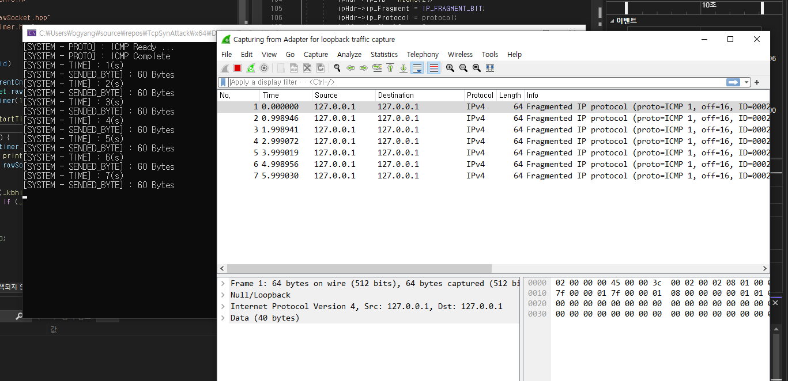

# Raw Socket Programing

* 날짜 : 2023-11-07
* 운영체제 : Window 10 Pro
* 소프트웨어 : Wireshark Version 4.0.10 , Visual Studio 2022 (Winsock2 사용) 
* 내용 : RawSocket을 이용한 TCP Sync Attack , ICMP Attack 구현
* 문제점 : Window XP SP2 버전 이후 부터는 RawSocket TCP 제작 (Bind 불가)하고, ICMP IP Spoofing 하여 데이터 전송 시 IP 패킷 생성 안됨. -> 차후 커널 분석 후 해결 예정

`결과`  
